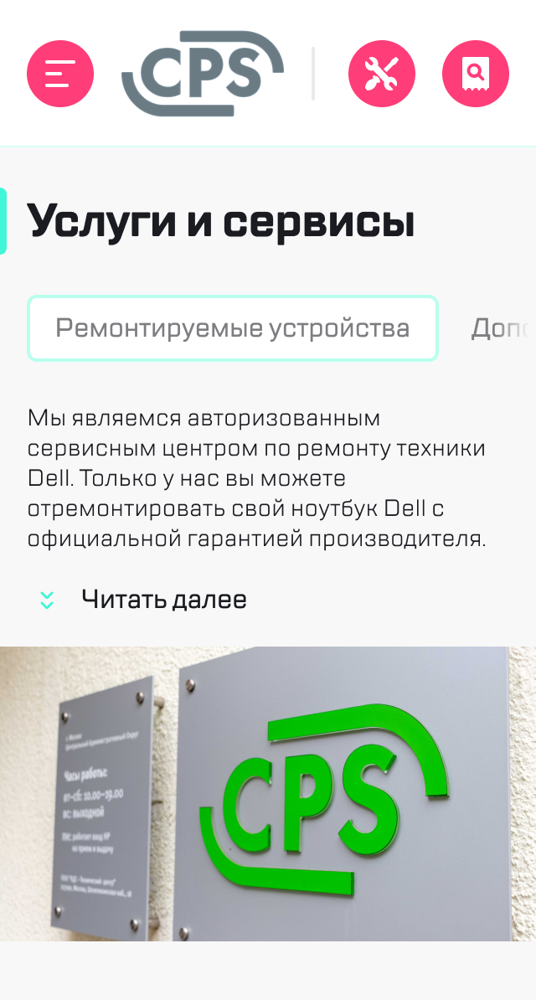
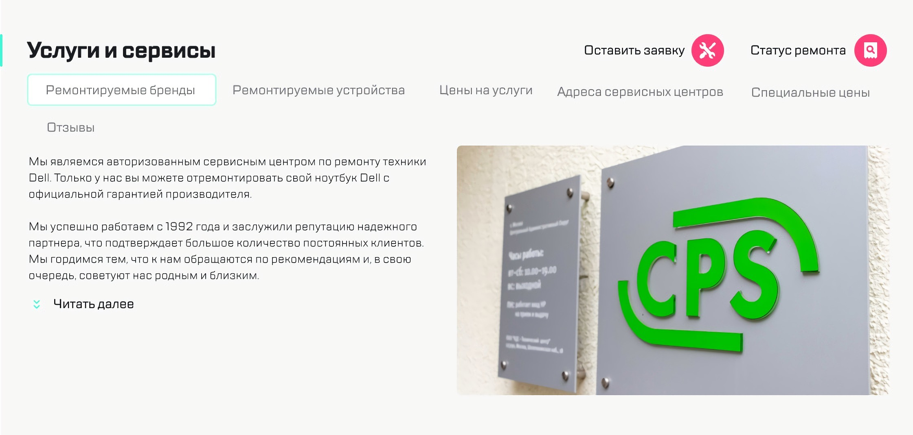

# Задание

## Сверстать блок из макета, выложить на Github/Github pages.

* Это часть макета из блока 1.6, поэтому выделяйте общие элементы исходя из итогового макета.
*    Для верстки использовать flexbox.
*    Используем подход Mobile First: Сначала верстаем версию на 320px - потом прописываем измнения для остальных экранов
*    Шрифт для макета
*    Все стили должны быть по БЭМ. Стиль именования - two dashes: block-name__elem-name--mod-name--mod-val
*    На мобилке меню скроллится с помощью стандартного горизонтального скролла, см. свойство overflow
* На различный порядок и количество пунктов меню не обращайте внимание - меню на всех разрешениях должно быть одинаковым. По непонятным моментам в макете - обращайтесь к однокурсникам или ментору.

### Скриншоты:
<head>
    <meta charset="UTF-8">
    <link rel="stylesheet" href="css/screenshots.css">
</head>
<body>
    

        

            
        

        

            
        

        

            
        

    

</body>

